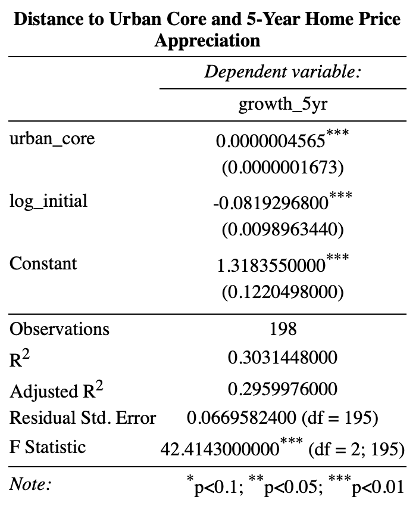
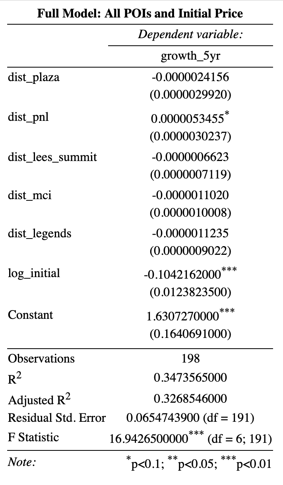

# Price-Tier Convergence and Spatial Housing Appreciation: Evidence from the Kansas City MSA

## Project Overview

This project analyzes 5-year cumulative home price appreciation across ZIP codes in the Kansas City Metropolitan Statistical Area (MSA).

Using spatial distance metrics and econometric modeling, the analysis quantifies how proximity to major commercial hubs influences residential asset appreciation and identifies areas outperforming traditional urban core trends.

The objective is to translate spatial economic analysis into actionable insight for real estate development, asset management, and urban planning.

---

## Tools Used

- **SAS** – Data cleaning and ZIP code filtering  
- **QGIS** – Spatial distance computation to major points of interest  
- **R** – Regression modeling, visualization, and statistical diagnostics  

---

## Methodology

### 1. Price Appreciation Metric

5-year cumulative price appreciation is measured using log price change:

Price Appreciation = ln(P_final) − ln(P_initial)

This formulation allows interpretation in approximate percentage terms while reducing skewness in housing price distributions.

---

### 2. Spatial Variables

Distances were computed from ZIP-code centroids to major Points of Intrest (POIs), including:

- The Plaza  
- Power & Light District  
- The Legends
- MCI Airport
- Lee's Summit

An “Urban Core Distance” metric was constructed as:

UrbanCoreDist = (DistanceToPlaza + DistanceToPowerLight) / 2

This captures compounded centrality relative to Kansas City's traditional commercial core.

---

### 3. Econometric Specification

Baseline model:

Appreciation_i = β0 + β1 Distance_i + ε_i

Extended specifications include:

- Urban core distance  
- Interaction term: Urban core distance + log(initial price)  
- Diagnostic checks for heteroskedasticity and multicollinearity  

---

## Key Findings
### Stronger Suburban Appreciation
Peripheral ZIP codes exhibit stronger 5-year price appreciation relative to the urban core.

### Interaction Effects: Initial Price × Urban Core Distance
The interaction model tests whether the effect of distance varies across price tiers. Results indicate that baseline price segmentation—not urban centrality—is the primary driver of five-year appreciation. The interaction term is statistically significant but economically small, reinforcing that proportional catch-up among lower-priced ZIP codes explains most observed growth patterns.

### Full Model Results
The preferred specification explains approximately 35% of cross-sectional variation in five-year appreciation (R² ≈ 0.34).
The dominant result is clear: lower-priced ZIP codes appreciated faster over 2021–2026, consistent with β-convergence dynamics. Distance from the historic urban core has negligible practical impact once baseline price tier is accounted for.

---

## Investment & Planning Implications

- **Developers / Asset Managers:** Peripheral ZIP codes may present under-recognized appreciation opportunities.  
- **Urban Planners / Local Government:** Rapid outer-rim appreciation may warrant strategic infrastructure and zoning attention.  
- **Market Analysts:** Spatial econometrics provides measurable evidence of location-driven capital appreciation.  

---

## Repository Structure

/data        → Input datasets  
/scripts     → SAS data cleaning and Regression and visualization scripts
/figures     → Maps and output visualizations  

---

## Replication Notes

1. Place all CSV files inside the `/data` folder.  
2. Set your SAS or R working directory to the project root.  
3. Run scripts in order:
   - SAS (data cleaning)  
   - QGIS (distance computation)  
   - R (regression and visualization)  

Note: Spatial distance calculations were performed in QGIS and exported as CSV inputs for regression analysis.

---

## Author

Matthew Ong
mong01@tamu.edu
